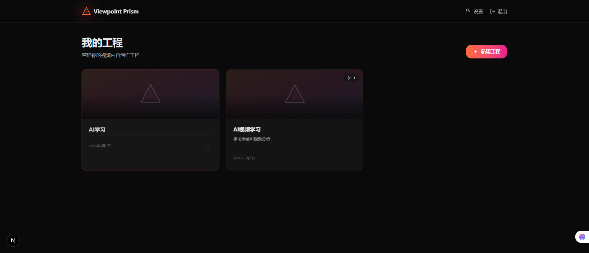
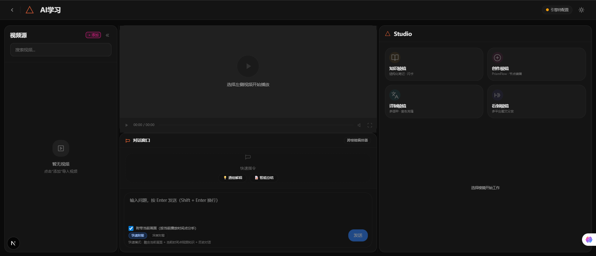
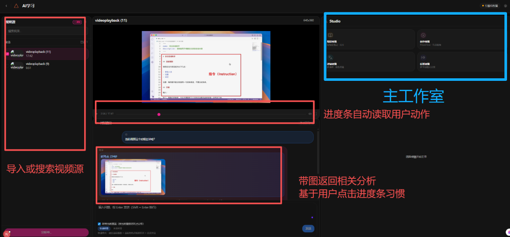
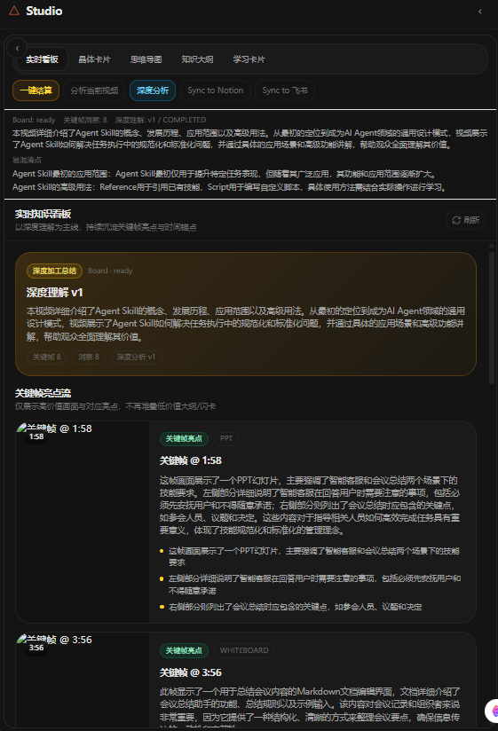
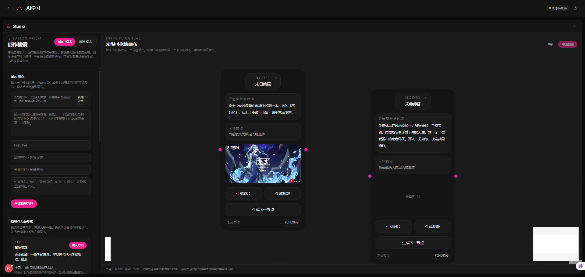
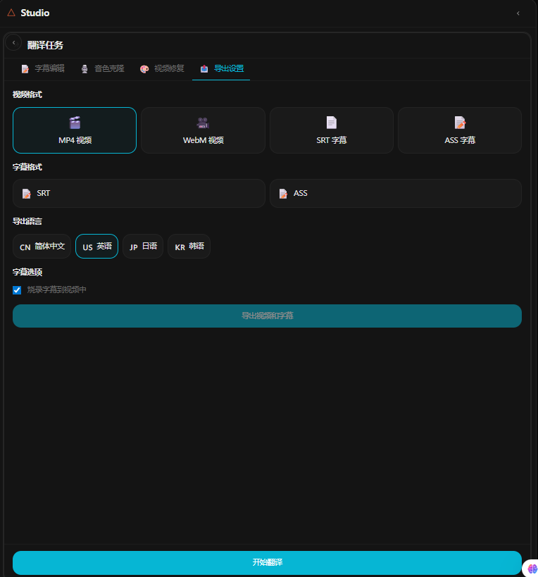
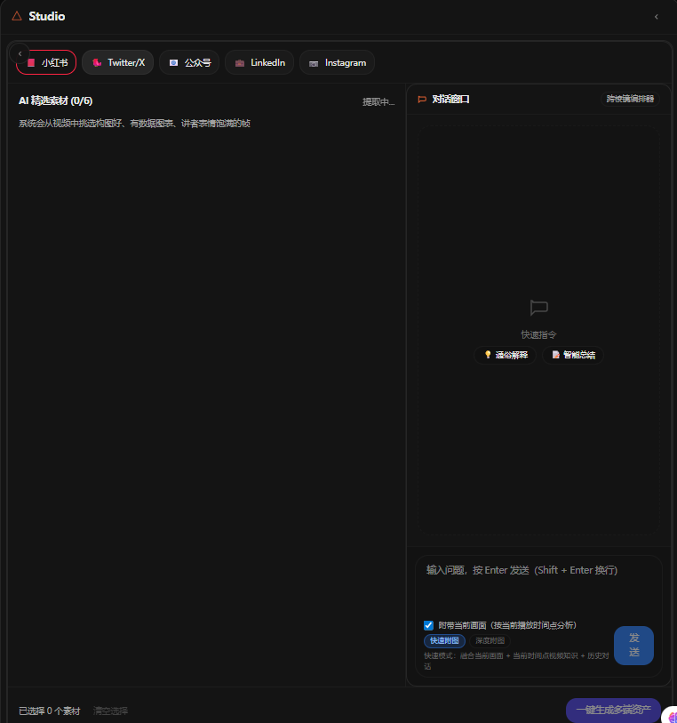

# Viewpoint Prism Pro 项目说明文档

## 1. 产品简介

**Viewpoint Prism Pro** 是一个面向视频内容理解、知识沉淀、二次创作、多语种本地化与内容分发的 AI 工作台。

它的核心思路不是把视频当成“一次性消费素材”，而是把视频视为一个可以持续拆解、加工、复用的 **内容资产源**。  
围绕同一条视频，系统提供四条能力链路：

- **学习棱镜**：把视频转成结构化知识、大纲、思维导图、学习卡片与问答资产
- **创作棱镜**：把 idea、剧本或分析结果转成分镜节点、图片、视频与可迭代画布
- **翻译棱镜**：把视频转成多语言字幕、配音和本地化版本
- **衍射棱镜**：把视频进一步转成公众号、小红书、社媒等多平台传播内容

从产品定位上，它不是单个 AI 功能，而是一个 **面向视频内容全生命周期的多棱镜工作台**。

---

## 2. 产品要解决的问题

当前视频工作流普遍存在四类问题：

1. **视频知识难以结构化**
- 看完视频只能得到碎片印象，无法沉淀为长期可用的知识资产

2. **创作流程工具割裂**
- 灵感、脚本、分镜、图片生成、视频生成分散在多个工具里，切换成本高

3. **译制和出海成本高**
- 字幕、翻译、配音、术语管理、画面替换往往需要重复劳动

4. **视频二次利用率低**
- 一条视频通常只产出一个视频成品，难以继续生成学习卡片、文章、图文内容和传播素材

Viewpoint Prism Pro 的目标，是把这些原本割裂的步骤统一收拢到一个工作台中完成。

---

## 3. 产品整体工作流

### 图 1：工程创建与项目入口

**说明**

- 用户首先进入“我的工程”页面，统一管理不同的视频项目
- 每个工程代表一条完整的视频资产工作流，后续的学习、创作、翻译、分发都会围绕该工程展开
- “新建工程”入口把零散的视频处理任务，升级为可长期管理的项目空间

### 图 2：工作台总览

**说明**

- 左侧是 **视频源管理区**：负责上传、选择、搜索与切换视频素材
- 中间是 **播放器 + Chat 工作区**：负责时间点分析、暂停问答、上下文理解
- 右侧是 **Studio 棱镜区**：用户可在学习、创作、翻译、衍射四个棱镜之间切换
- 这是本产品的核心交互结构：**同一条视频上下文，被四条不同工作流复用**

### 图 3：视频导入、分析与对话联动

**说明**

- 用户可以先导入视频，再对视频进行结构化分析
- Chat 不只是普通聊天框，而是和当前视频播放时间、当前暂停画面、历史分析结果联动
- 用户在播放器暂停某一帧时提问，系统会结合：
  - 当前视频上下文
  - 当前暂停画面
  - 历史知识分析结果
  - 当前问题
  生成更准确的回答
- 这让“对话助手”从纯问答工具，变成视频工作流中的智能控制与分析入口

---

## 4. 四大棱镜能力

## 4.1 学习棱镜：把视频转成知识资产

### 图 4：学习棱镜 / Knowledge Board

**功能说明**

- 自动抽取视频中的关键帧、章节与核心讲解点
- 生成结构化大纲、深度分析、知识卡片与学习卡片
- 支持对当前视频继续追问，并把问答补充写回知识资产
- 支持思维导图、晶体卡片、学习卡片等多种知识视图

**产品价值**

- 让视频从“观看对象”转化为“可复习、可检索、可导出的知识资产”
- 对课程学习、研究整理、会议记录、培训复盘场景非常有价值

---

## 4.2 创作棱镜：把想法和剧本转成节点化创作流程

### 图 5：创作棱镜 / 创作者画布

**功能说明**

- 支持 **Idea 模式**：从一句创意出发，生成故事方向、首节点和后续分镜候选
- 支持 **编剧模式**：导入长文本/剧本后，按章节、节点拆分生成镜头流
- 中央采用 **无限可拖拽画布**，每个节点都可单独管理：
  - 分镜描述
  - 人物锚点
  - 图片生成
  - 视频生成
  - 下一节点推演
- 后续节点会继承前一节点的连续性约束，尽量保证人物、服装、道具和场景衔接稳定

**产品价值**

- 把 AI 视频创作从“一次性整段生成”升级为“节点化、可编辑、可迭代的分镜生产流程”
- 更适合剧情短视频、广告视频、视觉叙事视频等高可控创作场景

---

## 4.3 翻译棱镜：把视频转成多语言版本

### 图 6：翻译棱镜 / 本地化工作流

**功能说明**

- 自动完成字幕识别、翻译与术语统一
- 支持多语种版本生成
- 适配出海传播、课程本地化、品牌多语言传播场景
- 后续可继续扩展到画面文字替换、配音与语音克隆

**产品价值**

- 让单一语种视频快速转为多语言传播版本
- 降低人工翻译和配音成本，提高出海与多地区传播效率

---

## 4.4 衍射棱镜：把视频转成平台化传播内容

### 图 7：衍射棱镜 / 内容裂变工作流

**功能说明**

- 从视频中抽取适合传播的关键帧与内容重点
- 生成适合不同平台的图文内容与发布素材
- 面向公众号、小红书、社媒长帖等场景输出二次内容

**产品价值**

- 一条视频不再只对应一个视频成品，而是进一步产出：
  - 图文摘要
  - 平台文案
  - 配图素材
  - 分发包

---

## 5. 产品亮点

## 5.1 同一视频，多条资产链路同时产出

这是产品最核心的亮点。  
传统工具往往只解决一个单点问题：总结、翻译、生成、分发其中之一。  
Viewpoint Prism Pro 则围绕同一条视频，同时生成：

- 知识资产
- 创作资产
- 本地化资产
- 分发资产

这让视频从单一内容文件，升级为一个多用途资产入口。

## 5.2 统一工作台，而不是功能堆叠

产品采用统一工作台结构：

- 左侧：视频源与素材
- 中间：播放器与对话
- 右侧：棱镜工作流

这让用户不需要在多个工具间来回切换，所有上下文天然共享。

## 5.3 Chat 深度嵌入业务，而不是独立聊天框

Chat 会和视频时间点、暂停帧、知识资产、创作节点联动。  
它不是“一个放在角落里的 AI 聊天框”，而是工作流中的智能中台。

## 5.4 创作棱镜的节点化方法更适合专业生产

创作棱镜不是一键生成整条视频，而是采用：

- 节点
- 分支
- 连续性约束
- 局部再生成

这种方式更接近真实创作流程，可控性明显高于整段式生成。

---

## 6. 技术方案特色

## 6.1 模块化后端架构

后端基于 **NestJS**，按业务域拆分为：

- `auth`
- `project`
- `video`
- `chat`
- `prism-knowledge`
- `prism-creation`
- `prism-translation`
- `prism-diffraction`

好处是：

- 业务边界清楚
- 便于新增棱镜
- 便于将 AI 能力和具体业务解耦

## 6.2 AI Router 统一调度模型

系统不是把业务代码直接绑死到单一模型接口，而是通过 AI Router 统一管理：

- LLM_CHAT
- MULTIMODAL
- IMAGE_GEN
- VIDEO_GEN
- ASR
- TTS

支持：

- 多 provider 切换
- BYOK（用户自带 API Key）
- 任务级路由与 fallback

## 6.3 长任务异步化

系统使用：

- `Redis + BullMQ`

来处理长耗时任务：

- 视频分析
- 关键帧提取
- 生图
- 视频生成
- 导出

前端通过 WebSocket 获取进度，避免用户被同步请求卡住。

## 6.4 媒体资产统一存储

系统通过：

- `MinIO / S3`
- `FFmpeg`

实现：

- 视频上传
- 关键帧抽取
- 缩略图生成
- 导出文件管理
- 资源统一访问

## 6.5 前端工作台 + 节点画布

前端基于：

- `Next.js`
- `React`
- `Tailwind CSS`
- `Zustand`
- `React Flow`

其中 `React Flow` 用于实现创作棱镜的无限画布与节点关系，这使产品不只是“普通后台页面”，而是具备生产级编辑器形态。

---

## 7. 产品典型应用场景

### 场景 1：课程 / 知识视频学习

用户上传课程视频后，可生成：

- 结构化大纲
- 关键帧
- 晶体卡片
- 学习卡片
- 思维导图

再通过 Chat 补充理解，形成完整学习闭环。

### 场景 2：剧情短视频 / 视觉创作

用户从一句 idea 或一份剧本出发，生成：

- 故事方向
- 节点分镜
- 分镜图
- 视频片段
- 串联成片

### 场景 3：视频出海和本地化

用户将中文视频转成：

- 英文字幕版
- 其他语言字幕版
- 后续可扩展配音版

适合教育、品牌传播和海外社媒场景。

### 场景 4：内容运营和多平台分发

用户从一条视频继续产出：

- 公众号文章
- 小红书图文
- 社媒短帖
- 平台化素材包

提高单条视频的内容利用率。

---

## 8. 评审建议关注点

建议评审重点关注以下几个维度：

1. **完整性**
- 是否形成从视频导入到多资产输出的闭环

2. **场景创新性**
- 是否把学习、创作、翻译、分发统一到同一个视频工作台内

3. **AI 融合深度**
- 是否真正把 AI 嵌入具体工作流，而不是只做独立对话框

4. **可扩展性**
- 四大棱镜是否具备继续扩展更多能力的空间

5. **工程合理性**
- 是否具备模块化架构、统一模型调度、异步任务处理与媒体资产管理能力

---

## 9. 总结

Viewpoint Prism Pro 的核心价值，不是“又一个 AI 视频工具”，而是建立了一种新的工作方式：

- 把视频视为可持续拆解的内容资产入口
- 把 AI 深度嵌入视频后续处理的每一个环节
- 把学习、创作、翻译、传播四条链路统一进一个工作台

从产品上，它更接近一个 **视频资产操作系统**。  
从技术上，它具备：

- 模块化后端
- 多模型路由
- 队列与异步任务
- 媒体处理与对象存储
- 节点化前端画布

这也是它区别于单点式 AI 工具的根本竞争力。
